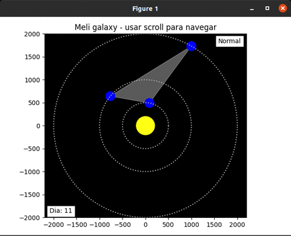

# meli-galaxy


[](https://codecov.io/gh/hslavich/meli-galaxy)

Deploy en Google App Engine: https://meli-examen.rj.r.appspot.com/

## Instalación

- Buildear imagen docker
```
docker build -t meli-galaxy .
```
- Ejecutar script `main.py` que devuelve los resultados
```
docker run meli-galaxy python main.py
```
```
Total períodos de sequía: 41
Total períodos de lluvia: 81
Día pico máximo de lluvia: 79
Total períodos de condiciones óptimas: 122
```
- Ejecutar api
```
docker run -it -p 8080:8080 meli-galaxy python api.py
```

### Modo gráfico
Requiere python3 (probado con 3.8)
```
pip3 install -r requirements.txt
python3 gui.py
```

<p align="center">
  
</p>


## Solución

La solución implementada consiste en simular el movimiento de los planetas día por día en un rango de tiempo y analizar en cada paso el estado de la galaxia.
Luego de ejecutar la simulación se calculan los períodos generados y se obtiene información de ellos.

**Posición de los planetas:** El objeto planeta tiene como propiedad el angulo formado con respecto al sol. En cada paso se calcula el angulo nuevo teniendo en cuenta la velocidad, la dirección y la cantidad de días que se avanzó. <br>
La posición `(x, y)` se calcula con `x = coseno(angulo) * distancia` y `y = seno(angulo) * distancia`

**Clima óptimo:** El clima óptimo de presión y temperatura sucede cuando existe una linea recta que atraviesa los tres planetas. Para calcularlo se genera la recta de ajuste lineal entre los tres puntos, es decir la recta donde se minimizan las distancias. <br>
Luego se calculan las distancias mínimas entre los puntos y la recta (usando esta [fórmula](https://en.wikipedia.org/wiki/Distance_from_a_point_to_a_line)), si las distancias son menores al radio del planeta entonces el clima es óptimo.

**Clima sequía:** El clima de sequía sucede cuando la distancia entre el sol (punto (0,0)) y la recta de ajuste lineal es menor al radio del sol.

**Clima de lluvia:** Se asume que el clima de lluvia sucede cuando el centro del sol (0, 0) se encuentra dentro del triangulo formado por los tres planetas. <br>
Para identificar esto se calcula el area del triangulo formado por los tres planetas (`a1 = Area(PlanetaA, PlanetaB, PlanetaC`) y las areas de los tres triangulos formados por dos puntos y el (0, 0): <br>
`a2 = Area(Sol, PlanetaA, PlanetaB)` <br>
`a3 = Area(Sol, PlanetaA, PlanetaC)` <br>
`a4 = Area(Sol, PlanetaB, PlanetaC)` <br>
Si `a1 == a2 + a3 + a4` entonces el sol está dentro del triangulo
